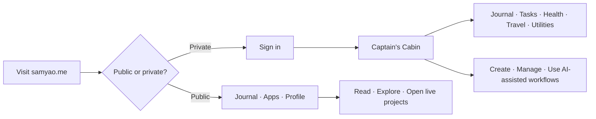
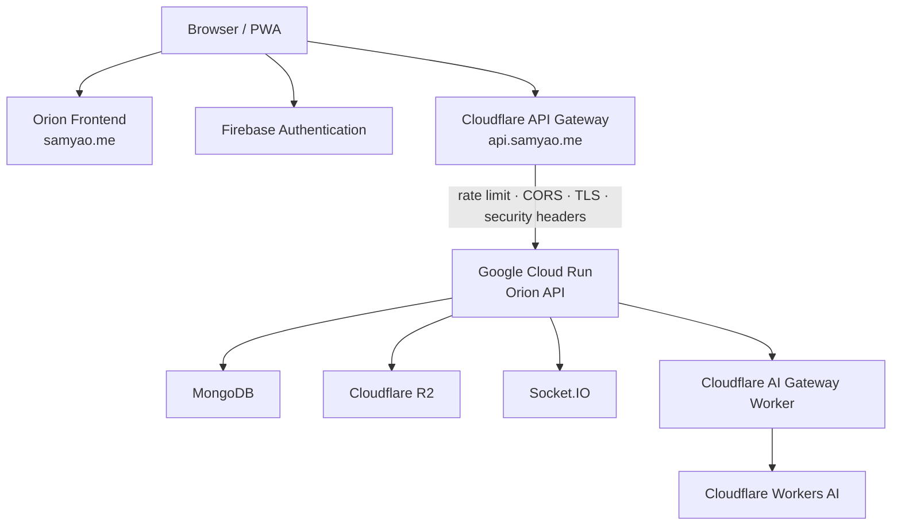
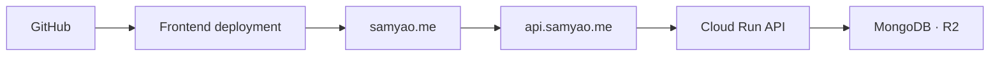

<div align="center">


# Orion

**Navigate your value.**

A bilingual digital garden, engineering portfolio, and personal operating system — built around a public journal, live project directory, and a private **Captain's Cabin** for writing, personal data, health, travel, and AI-assisted workflows.

[Live site](https://samyao.me) · [中文说明](README_CN.md) · [API](https://api.samyao.me)

</div>


## Why Orion

- **One place for public and private work** — portfolio, journal, personal systems, utilities, and private data live in one coherent product.
- **Writing-first architecture** — editor, preview, and published articles share the same rendering model instead of drifting into separate implementations.
- **Apps-first portfolio** — projects are treated as live products with demos, source links, categories, and bilingual presentation.
- **Private Captain's Cabin** — authenticated workspaces for notes, tasks, health, travel, personal data, utilities, and account-aware workflows.
- **AI where it is useful** — streaming assistants and project-import workflows augment existing product flows instead of becoming the product itself.
- **Built for production** — Cloudflare edge controls, a protected Cloud Run origin, PWA support, structured SEO, and explicit deployment boundaries.

## Product surface

### Public Orion

The public site is designed as a digital garden rather than a static résumé.

- searchable bilingual journal
- rich article reading with reactions and comments
- Apps-first engineering portfolio
- live demos and source links
- public profile and professional experience
- responsive desktop, tablet, and mobile layouts
- installable PWA experience

### Captain's Cabin

Private routes provide an authenticated personal workspace behind API-enforced permissions.

Current areas include:

- private journal and second-brain workflows
- to-do and personal productivity systems
- fitness and health records
- photo gallery
- travel and footprint map
- account-aware utilities
- AI-assisted workflows

## Journal and writing system

Orion treats writing as one end-to-end system instead of separate editor and reader products.

The writing studio currently supports:

- Tiptap rich-text editing
- headings, blockquotes, typography, colours, tables, and tasks
- syntax-safe LaTeX paste
- code blocks that preserve dollar delimiters
- emoji and online GIF search
- supported video embeds
- editable SVG handwriting
- clipboard image upload to Cloudflare R2
- legacy Quill HTML compatibility
- draft isolation by account
- publishing guards while media is still uploading

Example display math:

```text
$$P(\text{mW}) = 10^{\frac{\text{dBm}}{10}}$$
```

The editor, live preview, and published article intentionally share the same content renderer so formatting does not change between authoring and reading.

## User flow



## Architecture

Production separates the public frontend from the protected API origin.

The browser does not need the Cloud Run hostname. Production API and realtime traffic use `https://api.samyao.me`.



### Production API edge

`api.samyao.me` is a Cloudflare Worker custom domain in front of Cloud Run.

- Cloudflare terminates TLS, applies per-IP rate limits, handles CORS preflight, and adds security headers before requests reach the application.
- The Worker injects a private `x-orion-edge-secret`; Cloud Run rejects direct `/api/*` requests that do not carry the matching server-side secret.
- The public `run.app` hostname therefore cannot execute normal API business logic directly.
- Cloud Run uses bounded scaling as an additional cost and surge guardrail.
- Mutable portfolio, journal, and homepage API responses use `Cache-Control: no-store` so successful writes become visible immediately.
- Edge caching is reserved for data with an explicit staleness contract.
- Authenticated and BYOK secrets stay out of URLs and browser persistence. Optional AI credentials are session-only and forwarded only for the current request.

## GitHub → Apps import

Portfolio import turns a repository into a reviewable Orion project draft.

```text
GitHub URL
  → validate repository
  → fetch metadata
  → read README / package.json
  → Cloudflare Workers AI analysis
  → bilingual portfolio draft
  → deterministic Orion cover
  → review in Project editor
  → Save Project
```

The backend returns progress as Server-Sent Event formatted frames over a streaming POST response. The React client reads the stream with `fetch()` and updates progress in real time.

Preview generation does not write MongoDB or upload R2 assets. Persistence happens only when **Save Project** is pressed.

## Project layout

```text
orion-frontend/
|
+-- components/          shared UI, journal editor/reader, profile and private widgets
+-- pages/               public routes and Captain's Cabin workspaces
+-- services/            API, authentication, content and media clients
+-- i18n/                English and Chinese locale data
+-- constants/           navigation and built-in app catalogue
+-- tests/journal/       browser-level editor and renderer regression suite
+-- public/              PWA, SEO and project assets
```

Core frontend stack:

```text
React 19
TypeScript
Vite
Tailwind CSS
Tiptap
KaTeX
Firebase
Socket.IO
Recharts
ECharts
Leaflet
Puppeteer
```

## Local development

Requirements:

```text
Node.js 22+
pnpm 9+
```

Clone and start:

```bash
git clone https://github.com/orion-ai-club/orion-frontend.git
cd orion-frontend
pnpm install
pnpm dev:local
```

`pnpm dev:local` expects the API at:

```text
http://localhost:5000/api
```

Use `pnpm dev` when `VITE_API_URL` is already configured or when you want the production API fallback.

Create `.env` for environment-specific values:

```dotenv
VITE_API_URL=http://localhost:5000/api
VITE_FIREBASE_API_KEY=...
VITE_FIREBASE_AUTH_DOMAIN=...
VITE_FIREBASE_PROJECT_ID=...
VITE_FIREBASE_STORAGE_BUCKET=...
VITE_FIREBASE_MESSAGING_SENDER_ID=...
VITE_FIREBASE_APP_ID=...
```

Do not commit real credentials.

Firebase mock values keep unauthenticated local pages usable, while private features require the API and a valid account.

## Quality checks

```bash
pnpm typecheck
pnpm lint
pnpm test
pnpm build
```

The browser regression suite covers:

- LaTeX paste and rendering
- code preservation
- image upload and upload failure recovery
- handwriting undo / redo and serialization
- typography, emoji, and GIF insertion
- video round trips
- private draft isolation
- legacy content compatibility
- mobile overflow
- both Orion themes

## Data and security

- Public posts and portfolio data are readable without a session.
- Private routes are enforced by backend permissions, not only frontend routing.
- The frontend does not embed server-side secrets.
- Pasted HTML is sanitised before rendering.
- Unsafe links and untrusted video embeds are rejected.
- Media upload state prevents premature publishing.
- Durable remote media URLs are stored instead of local blob URLs.
- Production API traffic is routed through the Cloudflare gateway before reaching Cloud Run.
- The application contains personal modules; separate deployments should use their own environment, database, storage, and identity configuration.

## Deployment model



Orion deliberately keeps frontend delivery and API execution separate. This makes the public site independently deployable while preserving a protected origin for authenticated and private operations.

## Companion service

The frontend is backed by [new-bananaboom-api-2025](https://github.com/yaohuangguan/new-bananaboom-api-2025).

The companion API provides authentication, permissions, content, uploads, realtime events, personal-data APIs, and AI-assisted backend workflows.

## Contributing

Contributions and issue reports are welcome. Before opening a pull request:

```bash
pnpm typecheck
pnpm lint
pnpm test
pnpm build
```

Never include private journal content, exported account data, or real credentials in commits, issues, screenshots, or pull requests.
